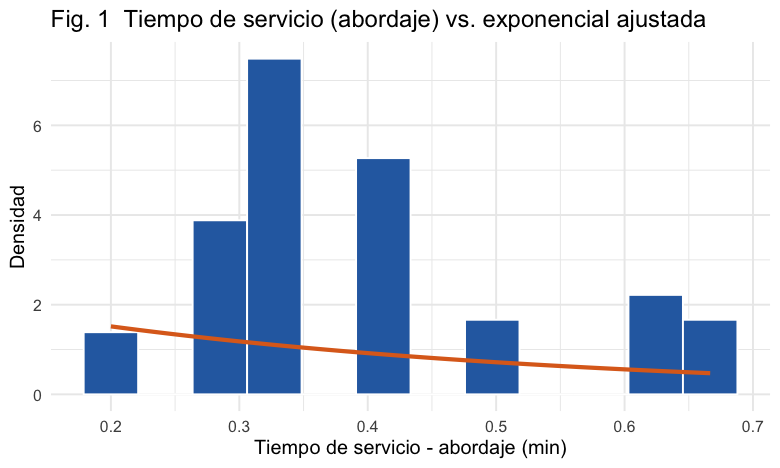
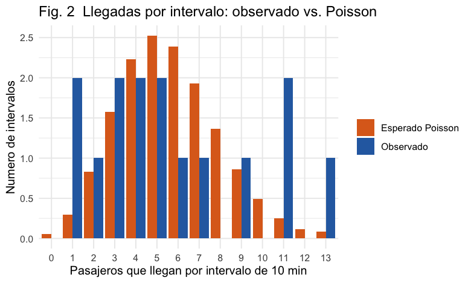
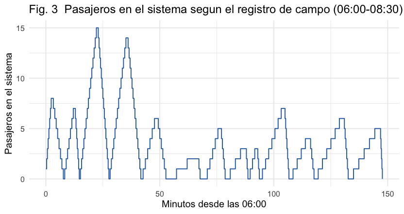
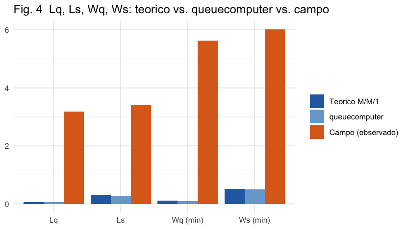

# Análisis de un sistema de colas M/M/1 utilizando R y `queuecomputer`

### Abordaje de pasajeros en la parada de La Cañada hacia Alajuela

---

**Curso:** Investigación de Operaciones / Teoría de Colas
**Carrera:** Ingeniería en Computación
**Docente:** ______________________
**Integrantes:** ______________________ · ______________________ · ______________________
**Fecha de entrega:** ______________________
**Valor:** ______________________

---

## 1. Portada

Informe técnico reproducible sobre el análisis de un sistema real de **una sola cola y un solo
servidor**: la **fila de abordaje de pasajeros** en la parada de salida de la ruta de buses
**La Cañada – Alajuela**. Se sigue la lógica metodológica del artículo de referencia (Eldesokey &
Ben Aros, 2023) pero sustituyendo QM‑Window por **R** y el paquete **`queuecomputer`**. Incluye la
recolección de datos de campo, la estimación de los parámetros de llegada y de servicio, las
pruebas de bondad de ajuste para Poisson y exponencial, la implementación del modelo M/M/1 y el
cálculo e interpretación de las medidas de desempeño.

---

## 2. Resumen ejecutivo

Se observó el **31 de agosto de 2026**, en el **pico de la mañana (06:00–08:30, 150 min)**, el
abordaje de pasajeros a los buses de la ruta La Cañada – Alajuela. El registro de campo tiene
**una fila por pasajero** (**85 pasajeros**, repartidos en **13 buses**). Para cada pasajero se
anotó la hora en que llegó a la parada, la hora en que empezó a abordar y la hora en que terminó,
además del bus en que se subió. El **servidor** es la **puerta del bus** (aborda un pasajero a la
vez, FIFO). El servidor se identifica como **`Servidor 1`**.

| Parámetro | Valor estimado |
|---|---|
| Tasa de llegada de pasajeros, λ | **0.567 pax/min = 34.0 pax/hora** |
| Tiempo medio de servicio (abordaje), 1/μ | **0.40 min/pax (24 s)** |
| Tasa de servicio, μ | **2.5 pax/min = 150 pax/hora** |
| Factor de utilización, ρ = λ/μ | **0.227 → sistema ESTABLE; el servidor está libre el 77 % del tiempo** |

**Los dos supuestos del M/M/1 fallan:**

- **Llegadas ≠ Poisson.** El índice de dispersión de los conteos por intervalo es **2.54**
  (una Poisson tiene ≈ 1): los pasajeros llegan **en lotes**, un grupo por cada bus.
- **Servicio ≠ exponencial.** El tiempo de abordaje por pasajero es **casi constante** (coeficiente
  de variación = 0.32). Kolmogórov–Smirnov **rechaza** H₀ (D = 0.449; p ≈ 0) y el χ² también.

**Y hay un tercer problema, el más importante:** el "servidor" (la puerta) **solo existe cuando
hay un bus**. Entre buses no hay servicio. Por eso las medidas del M/M/1 —tanto las fórmulas como
`queuecomputer`— **subestiman enormemente** la espera real:

| Medida | Teórica M/M/1 | `queuecomputer` | **Observada en campo** |
|---|---|---|---|
| Wq (espera antes de abordar) | 0.12 min (7 s) | 0.10 min (6 s) | **5.62 min** |
| Ws (tiempo total en el sistema) | 0.52 min | 0.50 min | **6.02 min** |
| Lq (pasajeros esperando) | 0.07 | 0.05 | **3.19** (máx **15**) |

El M/M/1 solo "ve" la pequeña cola de pasajero‑detrás‑de‑pasajero en la puerta (segundos). La
espera real (**5.6 minutos**, y **el 100 % de los pasajeros esperó**) es sobre todo el tiempo que
el pasajero aguarda **a que llegue su bus**. De hecho, coincide con la regla clásica de transporte:
**Wq ≈ la mitad del intervalo entre buses** (headway medio ≈ 12 min → 6 min).

**Conclusión:** este sistema **no es un M/M/1**. El abordaje en sí es rápido y con holgura
(ρ ≈ 0.23); lo que determina la espera del usuario es la **frecuencia de la ruta**. La única
palanca real para reducir la espera es **poner más buses** (reducir el headway).

---

## 3. Introducción

La teoría de colas estudia sistemas en los que unidades llegan para recibir un servicio y, si la
demanda instantánea supera la capacidad, esperan.

El modelo **M/M/1** supone: llegadas en **proceso de Poisson**, **tiempos de servicio
exponenciales**, **un solo servidor** *siempre disponible*, capacidad y población infinitas y
disciplina **FCFS**. Con λ < μ hay régimen estacionario y fórmulas cerradas.

En este trabajo el "cliente" es el **pasajero** y el "servidor" es la **puerta del bus**: el
pasajero llega a la parada, **espera a que llegue su bus** y luego **aborda** (subir, pagar o
marcar, avanzar). El paquete `queuecomputer` reconstruye, a partir de los instantes de llegada y de
los tiempos de servicio, los instantes de salida de cada pasajero mediante una cola FIFO de un
servidor, y con ellos las medidas **computacionales** que se comparan contra las **teóricas** y
contra las **observadas en campo**.

---

## 4. Descripción del sistema seleccionado

| Elemento | Definición adoptada |
|---|---|
| **Nombre y ubicación** | Fila de abordaje en la parada de salida de la ruta **La Cañada → Alajuela**. Servidor: `Servidor 1` (la puerta del bus). |
| **Tipo de servicio** | Abordaje de un pasajero: subir al bus, pagar o marcar el pasaje y avanzar. |
| **Unidad que llega** | El pasajero que se incorpora a la parada para tomar el bus. |
| **Definición de llegada** | Instante en que el pasajero llega a la parada (`hora_llegada`). |
| **Inicio del servicio** | Instante en que el pasajero empieza a abordar (`hora_inicio_servicio`). |
| **Fin del servicio** | Instante en que el pasajero termina de abordar y libera la puerta (`hora_fin_servicio`). |
| **Número de servidores** | **1** (una puerta de abordaje; sube un pasajero a la vez). |
| **Disciplina de atención** | FIFO / FCFS. |
| **Capacidad de la cola** | Sin límite práctico; no se observó desistimiento. |
| **Día y horario** | 31 de agosto de 2026, **06:00–08:30** (pico de la mañana). |
| **Duración total del levantamiento** | 150 minutos de observación continua. |
| **Intervalo para contar llegadas** | Bloques de **10 minutos** (15 bloques). |
| **Método de registro** | Observación no participante en la parada. Para cada pasajero se anotó su hora de llegada, su hora de inicio y fin de abordaje, y el bus en que se subió (`id_bus`, con `hora_llegada_bus` y `hora_salida_bus`). No se registran nombres ni datos personales. |

**Decisión de modelado (declarada explícitamente).** Se analiza el abordaje como una cola M/M/1
con el pasajero como cliente y la puerta como servidor. Hay **tres razones** por las que el M/M/1
no describe bien este sistema, y se **reportan** en lugar de ocultarse (secciones 12–14 y 18):

1. **Vacaciones del servidor.** La puerta solo "atiende" mientras hay un bus. Entre buses no hay
   servicio, y ahí es donde el pasajero pasa la mayor parte de su espera.
2. **Llegadas en lotes.** Todos los pasajeros de un bus se acumulan antes de que llegue, así que
   las llegadas no forman un proceso de Poisson.
3. **Servicio casi constante.** El tiempo de abordaje varía poco (no es exponencial).

---

## 5. Objetivos del estudio

**General.** Analizar la fila de abordaje como un sistema M/M/1, estimando sus parámetros a partir
de datos de campo y evaluando su desempeño con R y `queuecomputer`.

**Específicos.**
1. Delimitar la población (pasajeros), el periodo y las condiciones de observación.
2. Estimar λ (pasajeros por unidad de tiempo) y μ (inverso del tiempo medio de abordaje).
3. Contrastar el ajuste de las llegadas por intervalo a una Poisson y de los tiempos de abordaje a
   una exponencial.
4. Verificar la condición de estabilidad ρ < 1.
5. Implementar la cola de un servidor con `queuecomputer` y calcular Lq, Ls, Wq, Ws, ρ y P₀.
6. Comparar las medidas teóricas, las de `queuecomputer` y las observadas en campo, e interpretar
   las diferencias.
7. Formular recomendaciones.

---

## 6. Metodología de recolección de datos

- **Diseño.** Observación directa continua durante 150 min en el pico de la mañana.
- **Registro por pasajero.** Para cada uno de los 85 pasajeros se anotó:
  `hora_llegada` (llegó a la parada), `hora_inicio_servicio` (empezó a abordar),
  `hora_fin_servicio` (terminó de abordar), y el bus (`id_bus`, `hora_llegada_bus`,
  `hora_salida_bus`).
- **Estructura del abordaje.** Los pasajeros de un mismo bus **se acumulan en la parada mientras
  esperan** y luego **abordan uno a uno** (FIFO) durante la parada del bus. Por eso el
  `tiempo_espera` de cada pasajero incluye, sobre todo, el tiempo que aguardó a que llegara su bus.
- **Conteo de llegadas.** Número de **pasajeros** que llegan en cada bloque de 10 minutos
  (`numero_llegadas_intervalo`).
- **Tamaño alcanzado.** **85 pasajeros** (13 buses) y 15 intervalos de conteo.
- **Unidades.** Todo el análisis en **minutos**.
- **Ajustes al archivo del grupo.** Se fijó `fecha = 2026-08-31` y `servidor = "Servidor 1"` para
  todas las filas; las horas (solo hora en el original) se combinaron con la fecha para formar
  fecha‑hora completas; las 4 variables derivadas se escribieron como FORMULAS de Excel sobre esas columnas de hora (hoja `formulas` del archivo).
- **Ética.** Solo variables operativas anónimas.
- **Reproducibilidad.** El registro está congelado en `datos_campo.xlsx`; `generar_datos.py`
  reconstruye ese archivo a partir del Excel de campo del grupo.

---

## 7. Descripción del archivo Excel y diccionario de datos

Archivo **`datos_campo.xlsx`**, con cuatro hojas (`observaciones`, `llegadas_intervalo`, `resumen`, `formulas`).

### Hoja `observaciones` (una fila por pasajero)

| Campo | Tipo | Descripción |
|---|---|---|
| `id_observacion` | entero | Identificador consecutivo (1…85). |
| `fecha` | fecha | 2026-08-31 (constante). |
| `id_bus` | entero | Bus en el que abordó el pasajero (1…15; solo 13 llevan pasaje). |
| `hora_llegada` | fecha‑hora | El pasajero llega a la parada. |
| `hora_inicio_servicio` | fecha‑hora | El pasajero empieza a abordar. |
| `hora_fin_servicio` | fecha‑hora | El pasajero termina de abordar. |
| `hora_llegada_bus` | fecha‑hora | Hora en que su bus llegó a la parada (contexto). |
| `hora_salida_bus` | fecha‑hora | Hora en que su bus salió de la parada (contexto). |
| `intervalo_observacion` | texto | Bloque de 10 min (`HH:MM-HH:MM`) en el que llegó el pasajero. |
| `numero_llegadas_intervalo` | entero | Nº de pasajeros que llegaron en ese bloque de 10 min. |
| `servidor` | texto | `Servidor 1` (constante). |
| `interarribo_min` | número | `hora_llegada − hora_llegada` del pasajero anterior. |
| `tiempo_espera_min` | número | `hora_inicio_servicio − hora_llegada` (incluye la espera del bus). |
| `tiempo_servicio_min` | número | `hora_fin_servicio − hora_inicio_servicio` (abordaje). |
| `tiempo_sistema_min` | número | `hora_fin_servicio − hora_llegada`. |
| `observaciones` | texto | Comentario operativo (vacío). |

> Las cuatro variables de tiempo van en el Excel como **fórmulas** (inciso 8), calculadas desde
> las columnas de hora (1440 = minutos por día, porque Excel guarda las fecha‑hora como días):
>
> | Columna | Fórmula en la celda (fila `r`, datos desde la fila 2) |
> |---|---|
> | `interarribo_min` (L) | `=(D{r}-D{r-1})*1440` &nbsp; *(L2 vacía: la 1.ª fila no tiene anterior)* |
> | `tiempo_espera_min` (M) | `=(E{r}-D{r})*1440` |
> | `tiempo_servicio_min` (N) | `=(F{r}-E{r})*1440` |
> | `tiempo_sistema_min` (O) | `=(F{r}-D{r})*1440` |
>
> donde `D = hora_llegada`, `E = hora_inicio_servicio`, `F = hora_fin_servicio`. La hoja
> **`formulas`** del Excel documenta esto. En R (sección 8) se recalculan con `difftime` para
> no depender del recálculo de Excel.

### Hoja `llegadas_intervalo` (una fila por bloque de 10 min)

Vista normalizada del conteo de pasajeros por intervalo. Es la que usa R para estimar λ y para la
prueba de Poisson.

| Campo | Tipo | Descripción |
|---|---|---|
| `fecha` · `intervalo_inicio` · `intervalo_observacion` · `duracion_min` (=10) · `numero_llegadas_intervalo` · `servidor` | — | 15 bloques de 06:00 a 08:30. |

### Hoja `resumen` (agregado por columna)

| columna | n | suma | promedio | mínimo | máximo | desv_est |
|---|---|---|---|---|---|---|
| `interarribo_min` | 84 | 144.33 | 1.718 | 0.33 | 9.67 | 2.002 |
| `tiempo_espera_min` | 85 | 477.88 | 5.622 | 1.67 | 11.67 | 2.040 |
| `tiempo_servicio_min` | 85 | 34.00 | 0.400 | 0.20 | 0.67 | 0.130 |
| `tiempo_sistema_min` | 85 | 511.88 | 6.022 | 2.00 | 11.87 | 2.016 |
| `numero_llegadas_intervalo` (15 bloques) | 15 | 85 | 5.667 | 1 | 13 | 3.79 |

---

## 8. Importación y preparación de datos en R

Este bloque **reproduce la estructura de código del inciso 8 del enunciado**
(`read_excel(..., sheet = "observaciones")` → `arrange(fecha, hora_llegada)` →
`mutate(interarribo_min / tiempo_espera_min / tiempo_servicio_min / tiempo_sistema_min = as.numeric(difftime(..., units = "mins")))`),
con dos añadidos: **(a)** convertir las horas de texto a `POSIXct` y **(b)** un control de calidad.

```r
library(readxl); library(dplyr); library(lubridate); library(ggplot2); library(queuecomputer)
ALPHA <- 0.05

obs  <- read_excel("datos_campo.xlsx", sheet = "observaciones")
intv <- read_excel("datos_campo.xlsx", sheet = "llegadas_intervalo")

obs <- obs %>%
  mutate(across(c(hora_llegada, hora_inicio_servicio, hora_fin_servicio),   # (a) texto -> fecha-hora
                ~ as.POSIXct(.x, tz = "UTC"))) %>%
  arrange(fecha, hora_llegada) %>%                                          # orden cronológico (inciso 8)
  mutate(                                                                   # las 4 variables del inciso 8, en minutos
    interarribo_min     = as.numeric(difftime(hora_llegada, lag(hora_llegada),        units = "mins")),
    tiempo_espera_min   = as.numeric(difftime(hora_inicio_servicio, hora_llegada,     units = "mins")),
    tiempo_servicio_min = as.numeric(difftime(hora_fin_servicio, hora_inicio_servicio,units = "mins")),
    tiempo_sistema_min  = as.numeric(difftime(hora_fin_servicio, hora_llegada,        units = "mins"))
  )

stopifnot(all(obs$tiempo_servicio_min > 0,  na.rm = TRUE))   # (b) control de calidad
stopifnot(all(obs$tiempo_espera_min  >= 0,  na.rm = TRUE))
```

No hay tiempos negativos, servicios nulos ni valores faltantes; no se excluyó ninguna observación.
Script completo y comentado en el anexo (`analisis_mm1.R`).

---

## 9. Estimación de la tasa de llegada λ

```r
total_llegadas   <- sum(intv$numero_llegadas_intervalo)   # 85
tiempo_total_min <- sum(intv$duracion_min)                # 15 × 10 = 150
lambda   <- total_llegadas / tiempo_total_min             # pasajeros por minuto
```

| | Valor |
|---|---|
| Total de pasajeros contabilizados | 85 |
| Tiempo total observado | 150 min |
| **λ** | **0.5667 pax/min = 34.0 pax/hora** |
| Interarribo medio (verificación) | 1.72 min (sd 2.0; los huecos grandes son entre buses) |

> **Poisson va sobre el conteo por intervalo, no sobre los interarribos.**

---

## 10. Estimación de la tasa de servicio μ

El "servicio" es el abordaje de un pasajero.

```r
media_serv <- mean(obs$tiempo_servicio_min)
mu <- 1 / media_serv
```

| | Valor |
|---|---|
| Tiempo medio de abordaje | **0.400 min/pax (24 s)** |
| Desviación estándar | 0.130 min |
| Mínimo – Máximo | 0.20 – 0.67 min |
| **Coeficiente de variación** | **0.32** (una exponencial tiene 1) |
| **μ = 1 / 0.400** | **2.50 pax/min = 150 pax/hora** |

El tiempo de abordaje es **poco variable** (entre 12 y 40 s). Esto anticipa que **no será
exponencial** (sección 13).

---

## 11. Análisis descriptivo y visualización de los datos

| Variable (min) | media | sd | mín | mediana | máx |
|---|---|---|---|---|---|
| Espera (llegada → inicio de abordaje) | 5.622 | 2.040 | 1.67 | 5.67 | 11.67 |
| Servicio (abordaje) | 0.400 | 0.130 | 0.20 | 0.33 | 0.67 |
| Tiempo en el sistema | 6.022 | 2.016 | 2.00 | 6.17 | 11.87 |

- **El 100 % de los pasajeros esperó**: nadie llega y aborda de inmediato, porque siempre hay que
  aguardar a que llegue el bus. La espera media es de **5.6 minutos**.
- **Tiempo de abordaje:** apenas 24 s de media, muy concentrado (12–40 s).
- **Llegadas por bloque de 10 min:** 1, 2, 3, …, hasta **13** (cuando se juntan los pasajeros de
  un bus grande). Media 5.7, pero **muy irregular**: índice de dispersión **2.54**.



*Figura 1. Histograma de los tiempos de abordaje con la exponencial ajustada (media 0.40 min). El
histograma está concentrado entre 0.2 y 0.67 min; la curva exponencial (que debería decaer desde 0)
no se le parece.*



*Figura 2. Pasajeros por intervalo de 10 min: observado vs. Poisson (λ̂ = 5.67). Lo observado tiene
mucha más masa en los extremos que una Poisson → sobredispersión por llegadas en lotes.*



*Figura 3. Número de pasajeros en el sistema según el registro de campo. Cada "diente de sierra"
es un bus: los pasajeros se **acumulan esperando** (rampa de subida, hasta 15) y luego **abordan**
rápidamente (bajada). Entre buses el sistema queda casi vacío.*

---

## 12. Prueba de bondad de ajuste para Poisson

**Variable:** número de **pasajeros** que llegan por intervalo de 10 minutos (15 intervalos).
**Hipótesis:** H₀: sigue Poisson. &nbsp; H₁: no. &nbsp; **α = 0.05.** &nbsp; **Prueba:** χ².

**Estimación:** λ̂ por intervalo = **5.667**.

| | Valor |
|---|---|
| media de conteos | 5.667 |
| varianza de conteos | 14.38 |
| **índice de dispersión (var/media)** | **2.54** (Poisson ideal ≈ 1) |

**Limitación de la prueba χ².** Con 15 intervalos y media 5.7, al exigir frecuencias esperadas ≥ 5
las categorías se agrupan hasta dejar **dos** (`0–5` y `≥ 6`) → **gl = 0**: la prueba **no es
concluyente**.

**Decisión / interpretación.** El **índice de dispersión (2.54)** muestra una **sobredispersión
marcada**: los pasajeros **no** llegan como un proceso de Poisson, sino **en lotes** (un grupo por
bus). Las llegadas de pasajeros a una parada están gobernadas por el horario de los buses. **El
supuesto de llegadas de Poisson del M/M/1 no se cumple.**

---

## 13. Prueba de bondad de ajuste para exponencial

**Variable:** tiempo de abordaje (85 observaciones).
**Hipótesis:** H₀: sigue exponencial. &nbsp; H₁: no. &nbsp; **α = 0.05.**
**Pruebas:** Kolmogórov–Smirnov y χ² con 6 clases equiprobables.

**Parámetro estimado:** `rate = 1 / 0.400` = **2.50 /min**.

| Prueba | Estadístico | Valor p | Decisión (α = 0.05) |
|---|---|---|---|
| Kolmogórov–Smirnov | D = 0.4487 | ≈ 0 (< 10⁻¹⁵) | **Se rechaza H₀** |
| χ² (6 clases equiprobables, gl = 4) | χ² = 199.1 | ≈ 0 | **Se rechaza H₀** |
| Coeficiente de variación | 0.324 | — | Exponencial ideal = 1 |

**Interpretación.** El tiempo de abordaje por pasajero es **casi constante** (12–40 s), mientras
que una exponencial produciría muchos valores cerca de 0 y una cola larga. **El supuesto de
servicio exponencial del M/M/1 no se cumple.**

---

## 14. Verificación de los supuestos del modelo M/M/1

| Supuesto | Verificación | Resultado |
|---|---|---|
| Llegadas Poisson | Sección 12: índice de dispersión = 2.54; χ² no concluyente | ✗ **No se cumple** — llegadas en lotes |
| Servicio exponencial | Sección 13: KS y χ² rechazan (p ≈ 0); CV = 0.32 | ✗ **No se cumple** — abordaje casi constante |
| Un solo servidor | La puerta atiende a un pasajero a la vez | ✔ |
| **Servidor siempre disponible** | La puerta solo existe cuando hay un bus (vacaciones entre buses) | ✗ **No se cumple** — es lo que domina la espera |
| Disciplina FCFS | Se aborda en orden de llegada | ✔ |
| **Estabilidad ρ = λ/μ < 1** | ρ = 0.5667 / 2.50 = **0.227** | ✔ **Muy estable** |

**Los supuestos distribucionales fallan y, sobre todo, el servidor no está siempre disponible.**
Las medidas M/M/1 de la sección 16 se reportan **solo como referencia** para el sub‑proceso de
abordaje; **no** describen la espera que percibe el usuario.

---

## 15. Implementación con `queuecomputer`

Este bloque **reproduce la estructura del inciso 11 del enunciado**
(`arrivals <- cumsum(interarrival_times)` → `queue(..., servers = 1)` →
`mutate(tiempo_sistema, inicio_servicio, tiempo_espera)`).

```r
interarrival_times    <- obs$interarribo_min
interarrival_times[1] <- 0
arrivals <- cumsum(interarrival_times)          # tiempos acumulados de llegada (min)
service  <- obs$tiempo_servicio_min             # tiempos de servicio (abordaje)

stopifnot(!is.unsorted(arrivals), all(service > 0))   # orden cronológico y misma unidad

salidas <- queue(arrivals = arrivals, service = service, servers = 1)

resultados <- data.frame(llegada = arrivals, servicio = service, salida = salidas) %>%
  mutate(tiempo_sistema  = salida - llegada,
         inicio_servicio = salida - servicio,
         tiempo_espera   = inicio_servicio - llegada)
```

**Nota importante.** `queue()` modela un servidor **siempre disponible**. Al alimentarlo con los
tiempos de llegada de los pasajeros y sus tiempos de abordaje, reconstruye únicamente la pequeña
cola **pasajero‑detrás‑de‑pasajero** en la puerta. **No** puede representar el tiempo que el
pasajero espera **a que llegue el bus**: por eso el `inicio_servicio` que calcula `queue()` queda
en promedio **5.5 min por debajo** del registrado en campo. Esa diferencia es exactamente el
fenómeno que el M/M/1 no captura (ver sección 18).

---

## 16. Medidas de desempeño teóricas (M/M/1)

Con λ = 0.5667 /min y μ = 2.50 /min. *Se reportan como referencia; los supuestos no se cumplen y
el servidor no está siempre disponible (sección 14).*

| Medida | Fórmula | Valor |
|---|---|---|
| Utilización del servidor | ρ = λ/μ | **0.2267** |
| Prob. servidor libre | P₀ = 1 − ρ | **0.7733** |
| Pasajeros esperando | Lq = λ² / [μ(μ − λ)] | **0.0664** |
| Pasajeros en el sistema | Ls = λ / (μ − λ) | **0.2931** |
| Espera para abordar | Wq = λ / [μ(μ − λ)] | **0.1172 min** (7 s) |
| Tiempo total en el sistema | Ws = 1 / (μ − λ) | **0.5172 min** (31 s) |

Comprobación: Ls − Lq = 0.227 = ρ ✔ ; Ws − Wq = 0.400 min = 1/μ ✔.

---

## 17. Medidas de desempeño obtenidas mediante R

Se reportan **dos** conjuntos calculados en R:

**(Q) Computacionales — de `queuecomputer::queue()`** (es lo que el enunciado llama
"resultados computacionales") — servidor siempre disponible:

| Medida | Valor |
|---|---|
| Wq | **0.096 min** (6 s) |
| Ws | **0.496 min** |
| Lq (Little) | 0.054 |
| Ls (Little) | 0.281 |

**(C) Observadas en campo — directamente del registro** — la espera **incluye aguardar al bus**:

| Medida | Valor |
|---|---|
| Wq (media de `tiempo_espera_min`) | **5.622 min** |
| Ws (media de `tiempo_sistema_min`) | **6.022 min** |
| Lq (Little, λ·Wq) | 3.186 |
| Lq por promedio temporal del largo de cola | 3.24 |
| Ls (Little, λ·Ws) | 3.413 |
| **Longitud máxima de cola observada** | **15 pasajeros** |
| % de pasajeros que tuvieron que esperar | **100 %** |
| Tasa efectiva de salida (throughput) | 85 / 150 = **0.567 pax/min = 34.0 /h** |

---

## 18. Comparación e interpretación de resultados



*Figura 4. Lq, Ls, Wq, Ws: teórico M/M/1 vs. `queuecomputer` vs. campo observado.*

| Medida | (T) Teórica<br>(fórmulas M/M/1) | (Q) Computacional<br>(`queuecomputer`) | (C) Observada<br>en campo |
|---|---|---|---|
| ρ | 0.227 | 0.227 | 0.227 |
| P₀ | 0.773 | 0.773 | 0.773 |
| Lq | 0.066 | 0.054 | **3.19** |
| Ls | 0.293 | 0.281 | **3.41** |
| Wq (min) | 0.117 | 0.096 | **5.62** |
| Ws (min) | 0.517 | 0.496 | **6.02** |

**Lectura.**

- **ρ y P₀ coinciden en las tres:** λ y μ están bien estimadas y el throughput observado es igual
  a λ. El **abordaje** en sí ocupa la puerta apenas el 23 % del tiempo.
- **(T) y (Q) dan una espera de segundos.** Ambas describen solo la cola en la puerta: como
  llegan pocos pasajeros por minuto y cada abordaje dura 24 s, casi nunca hay más de uno o dos
  esperando *para subir* una vez que el bus está.
- **(C) da 5.6 minutos**, ~60 veces más. La diferencia **no es error**: es el tiempo que el
  pasajero espera **a que llegue su bus**. `queue()` no lo puede reproducir porque supone que el
  servidor está siempre activo; en la realidad, entre buses **no hay servicio** (vacaciones del
  servidor).
- La espera de campo coincide con la **regla clásica de transporte**: para pasajeros que llegan al
  azar a un servicio con horario, **Wq ≈ mitad del intervalo entre buses**. Aquí el headway medio
  es ≈ **12 min**, así que se esperaría ≈ 6 min — y se observaron **5.6 min**.
- **Lq observado (≈ 3, con picos de 15)** también refleja esa acumulación: entre bus y bus se van
  juntando pasajeros en la parada.

**En resumen:** el M/M/1 (fórmulas y `queuecomputer`) modela bien el **sub‑proceso de abordaje**
—que es rápido y holgado— pero **no** el sistema que le importa al usuario, cuya espera la fija la
**frecuencia de la ruta**, no la puerta del bus.

---

## 19. Conclusiones

1. En el **sub‑proceso de abordaje**, el sistema es de **un servidor (la puerta), FIFO**, con
   **λ ≈ 34 pax/hora**, **μ ≈ 150 pax/hora** y **ρ ≈ 0.23**: muy estable, la puerta está libre el
   77 % del tiempo.
2. **El supuesto de llegadas de Poisson no se cumple:** los pasajeros llegan **en lotes** (índice
   de dispersión 2.54).
3. **El supuesto de servicio exponencial no se cumple:** el abordaje por pasajero es **casi
   constante** (CV = 0.32); KS y χ² rechazan la exponencial.
4. **El supuesto de servidor siempre disponible tampoco se cumple:** la puerta solo existe cuando
   hay un bus.
5. Por (2)–(4), tanto las **fórmulas M/M/1** (Wq ≈ 7 s) como **`queuecomputer`** (Wq ≈ 6 s)
   **subestiman enormemente** la espera real: en campo, **Wq = 5.6 min y el 100 % de los
   pasajeros esperó**, con hasta **15 pasajeros** acumulados en la parada.
6. Esa espera de campo ≈ **la mitad del intervalo entre buses** (headway ≈ 12 min).

---

## 20. Recomendaciones

**Operativas.**
- **La palanca real para reducir la espera es la frecuencia de la ruta:** más buses ⇒ menor
  headway ⇒ menor espera (que hoy es ≈ headway/2 ≈ 6 min). Acelerar el abordaje **no** ayuda: ya
  dura 24 s por pasajero y la puerta está libre el 77 % del tiempo.
- Publicar/estabilizar los **horarios** para que los pasajeros no lleguen tan temprano
  "por si acaso" reduciría también la espera percibida.

**Metodológicas.**
- Para este sistema, el modelo adecuado **no es M/M/1** sino un **análisis de headway** (la espera
  depende del intervalo entre buses y de su regularidad) o una cola con **vacaciones del
  servidor** / llegadas por lotes (M<sup>[X]</sup>/G/1). El M/M/1 sirve solo para el sub‑proceso
  de abordaje.
- Ampliar la observación a varios días y franjas y registrar el headway real de cada bus.

---

## 21. Limitaciones del estudio

- **El M/M/1 no aplica al sistema completo:** fallan los tres supuestos (Poisson, exponencial,
  servidor siempre disponible). Las medidas teóricas y de `queuecomputer` describen solo el
  abordaje, no la espera del usuario.
- **`queuecomputer` no modela la espera por el bus:** su Wq (6 s) no es comparable con la espera
  de campo (5.6 min); se muestran juntas para *evidenciar* qué deja fuera el modelo.
- **Un solo día y una franja horaria.**
- **Muestra de 15 intervalos** → la prueba χ² de Poisson no es concluyente.
- **ρ del abordaje muy bajo (0.23):** el cuello de botella no está en la puerta.
- **Resolución de 1 s** en las marcas de tiempo → empates (afectan a KS).

---

## 22. Referencias bibliográficas

- Eldesokey, A. I., & Ben Aros, A. M. (2023). *Controlling and Enhancing Performance Using
  QM‑Window in Queuing Models*. International Journal of Statistics and Applied Mathematics, 8(2),
  101–108. https://doi.org/10.22271/maths.2023.v8.i2b.959
- Cañadilla Jiménez, P., & Román Montoya, Y. (2017). *queueing: A Package For Analysis Of Queueing
  Networks and Models in R*. The R Journal, 9(2), 116–126.
- Ebert, A. (2016). *queuecomputer: Computationally Efficient Queue Simulation*.
  https://github.com/AnthonyEbert/queuecomputer
- Gross, D., & Harris, C. M. (1974). *Fundamentals of Queueing Theory*. Wiley.
- Vargas A., J. R. *Problemas resueltos de teoría de colas (M/M/1)*. Material de curso.

---

## 23. Anexos

- **Anexo A — `datos_campo.xlsx`**: registro por pasajero (`observaciones`), conteo por intervalo
  (`llegadas_intervalo`) y `resumen`. También en CSV.
- **Anexo B — `analisis_mm1.R`**: script R completo y comentado.
- **Anexo C — `generar_datos.py`**: reconstruye `datos_campo.xlsx` a partir del Excel de campo del
  grupo (`datos_85_pasajeros.xlsx`): fija fecha y servidor, arma las fecha‑hora y escribe las 4 variables derivadas como fórmulas de Excel.
- **Anexo D — `analisis_referencia.py`**: verificación independiente en Python (compara T, Q y C).
- **Anexo E — `R_salida.txt`**: salida de consola de `Rscript analisis_mm1.R`.
- **Anexo F — Figuras**: `R_fig1…4_*.png`.
- **Declaración de responsabilidades individuales** (completar):
  - Integrante 1 — trabajo de campo (horas y buses) y secciones 4–7.
  - Integrante 2 — script R y figuras (secciones 8–11, 15).
  - Integrante 3 — pruebas de bondad de ajuste y comparación T/Q/C (secciones 12–18).
  - Todos — definición del sistema, revisión, conclusiones y recomendaciones.

---

## Apéndice — Respuestas a las preguntas orientadoras

1. **¿Cuál es el fenómeno de espera y por qué es relevante?** Los pasajeros que esperan en la
   parada a que llegue su bus (y, en menor medida, la fila para subir por la puerta). Es la espera
   que percibe el usuario; aquí resultó de **5.6 min de media**.
2. **¿Cómo se definió llegada y servicio?** Llegada = el pasajero llega a la parada; inicio de
   servicio = empieza a abordar; fin = termina de abordar. El "servicio" es el abordaje (24 s).
3. **¿λ se mantuvo constante?** No en el corto plazo: los pasajeros llegan **en lotes** cuando se
   acerca la hora de un bus. La tasa media global es 34 pax/hora.
4. **¿Los datos respaldan Poisson para las llegadas?** **No.** Índice de dispersión 2.54
   (sobredispersión por lotes). El χ² no concluye por el tamaño de muestra.
5. **¿Los datos respaldan la exponencial para el servicio?** **No.** KS y χ² rechazan (p ≈ 0);
   el abordaje es casi constante (CV 0.32).
6. **¿El sistema es estable según ρ?** El **abordaje** sí, ampliamente: ρ = 0.23. Pero el sistema
   completo no es un M/M/1 (servidor con vacaciones).
7. **¿Cuánto espera en promedio un pasajero antes de abordar?** Teórico M/M/1 ≈ 7 s;
   `queuecomputer` ≈ 6 s; **observado en campo ≈ 5.6 min** (esperando el bus).
8. **¿Cuántas unidades hay en promedio en la cola y en el sistema?** Teórico/`queuecomputer`:
   Lq ≈ 0.05–0.07. **Campo: Lq ≈ 3.2, con un máximo de 15 pasajeros** acumulados.
9. **¿Diferencias entre teórico y `queuecomputer`?** Entre sí, casi ninguna (ambos ≈ 6–7 s de
   Wq). La diferencia grande es contra el **campo** (5.6 min): el M/M/1 no modela la espera por el
   bus (vacaciones del servidor). Ver sección 18.
10. **¿Qué recomendación surge?** Aumentar la **frecuencia** de la ruta (reducir el headway) es lo
    único que baja la espera; el abordaje ya es rápido. Metodológicamente, usar un análisis de
    headway o una cola con vacaciones, no M/M/1.
11. **¿Qué limitaciones impiden generalizar?** Un solo día y franja; 15 intervalos; y sobre todo
    que **el M/M/1 no representa este sistema** (fallan los tres supuestos).
